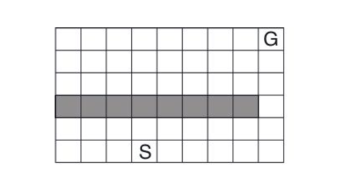
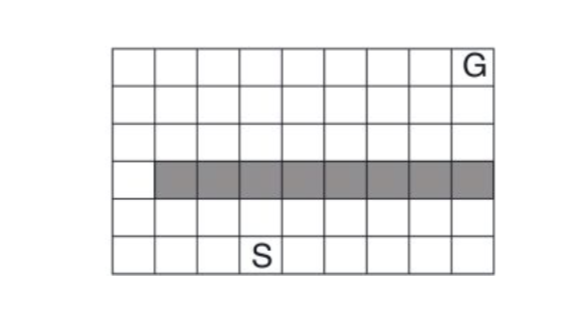
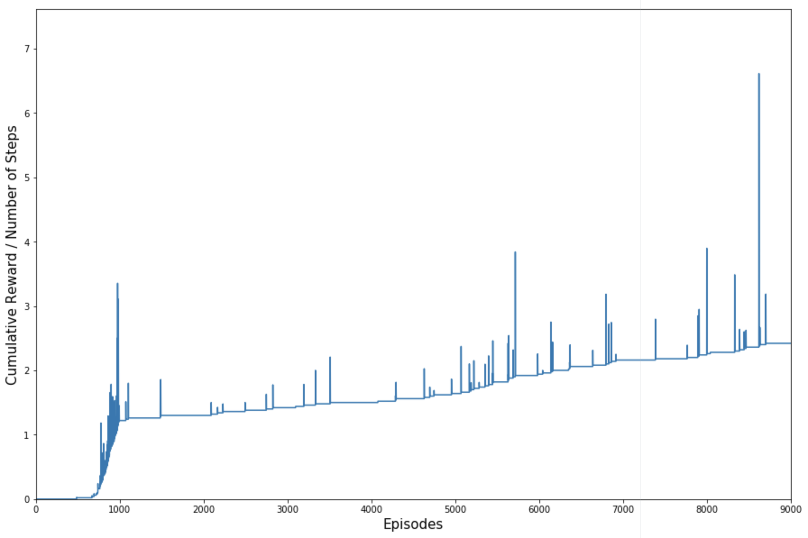

# gridworld-rl : Q-learning with Python

### Welcome to Gridworld

Suppose that an agent wishes to navigate Gridworld:

<p align="center"></p>

The agent, who begins at the starting state S, cannot pass through the
shaded squares (an obstacle), and "succeeds" by reaching the goal state G,
where a reward is given.

After the first 1000 attempts (episodes) to the navigate the grid, the obstacle moves, so
the agent must navigate a new grid:

<p align="center"></p>

The adaptation of the agent to moving obstacles is a demonstration of
[Q-learning](https://en.wikipedia.org/wiki/Q-learning). Here I implement
a successful adaptation of the agent to the moving obstacle.

### Installation

This implementation depends on [`numpy`](https://github.com/numpy/numpy),
[`matplotlib`](https://github.com/matplotlib/matplotlib), and OpenAI's
[`gym`](https://github.com/openai/gym). All code is written for Python 2.7.

In a command line, clone this repository and install the needed dependencies
with:

```bash
git clone https://github.com/ericeasthope/gridworld-rl.git
cd gridworld-rl
pip install -r requirements.txt
```

**Note**: for some users, `pip` may default to installing packages to Python 3.
Alternatively, to ensure that packages are installed to Python 2.7 (and if
`python2.7` is recognized as a path), use:

```bash
python2.7 -m pip install -r requirements.txt
```

### Testing

Here I am using [`pytest`](https://github.com/pytest-dev/pytest), which is
installed with the other dependencies. Run the tests
with:

```bash
cd gridworld-rl
pytest
```

### How to Use

Run the implementation with:

```bash
python gridworld.py
```

**Note**: for some users, `python` may default to using Python 3.
Alternatively, to ensure that `gridworld.py` executes with Python 2.7 (and if
`python2.7` is recognized as a path), use:

```bash
python2.7 gridworld.py
```

### Result

<p align="center"></p>

At first, the agent is seen to take many steps with little to no reward.

However, once the agent reaches the goal state G a number of times, the
ratio of cumulative reward to number of episodes appears to trend linearly.
The agent is also taking few steps to reach the goal state, so the ratio of
cumulative reward to number of steps tends to increase.

At the 1000th episode, whereupon the agent must adapt to a moved obstacle,
this trend in the reward-step ratio is temporarily disturbed.
Nevertheless, the agent continues to receive reward, and eventually learns
a new optimal policy for reaching for the goal state in fewer steps.
